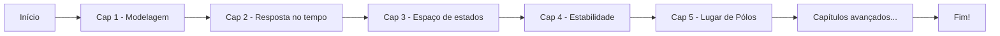

# 🏆 Desafio Ogata - Engenharia de Controle Moderno (5ª Edição)

Resolução de **TODOS** os exercícios do livro _Engenharia de Controle Moderno_ (Ogata, 5ª edição) usando MATLAB 2025.

---

## 🚀 Sobre o Desafio

Este é um desafio pessoal de engenharia: resolver todos os exercícios do livro do Ogata de capa a capa, com código MATLAB detalhado e comentado, promovendo o aprendizado aberto para toda a comunidade.

Acompanhe meu progresso, tire dúvidas, dê sugestões e resolva junto!

---

## 📊 Progresso

- **Total de exercícios:** `1`
- **Resolvidos até agora:** `1`
- **Percentual concluído:** `0`%

> Última atualização: 22/07/2025

| Capítulo | Exercícios | Resolvidos | %      | Mais difícil           | Destaque                        |
|----------|:----------:|:----------:|:------:|-----------------------|----------------------------------|
| 1        |  0        |    0      |  0%   | 0                    | 0                               |
| 2        |  0        |    0      |  0%   | 0                    | 0                               |

---

## 🏁 Roadmap do Desafio

## ⭐ Melhores Partes / Insights

Capítulo 2: 

## 💡 Como Usar

Cada exercício tem seu próprio arquivo MATLAB, com enunciado (resumido), resolução e comentários.

Arquivos organizados por capítulo e numeração original do livro.

Para rodar os scripts, basta abrir no MATLAB 2025 e executar.

Sugestões, dúvidas ou melhorias? Use o campo de issues ou faça um fork!

## 📚 Livro Usado

Engenharia de Controle Moderno – 5ª Edição

Autor: Katsuhiko Ogata

ISBN: 978-8536503379

## 🚩 Sobre o Autor do Desafio

Sou estudante de doutorado em Engenharia de Controle, estou fazendo isso porque nao sei nada de controle e quero aprender.

Meu LinkedIn | Meu GitHub

## 🤝 Contribuições

Contribuições são bem-vindas! Envie sugestões, correções ou resolva um exercício ainda não resolvido.

Licença

MIT License.

